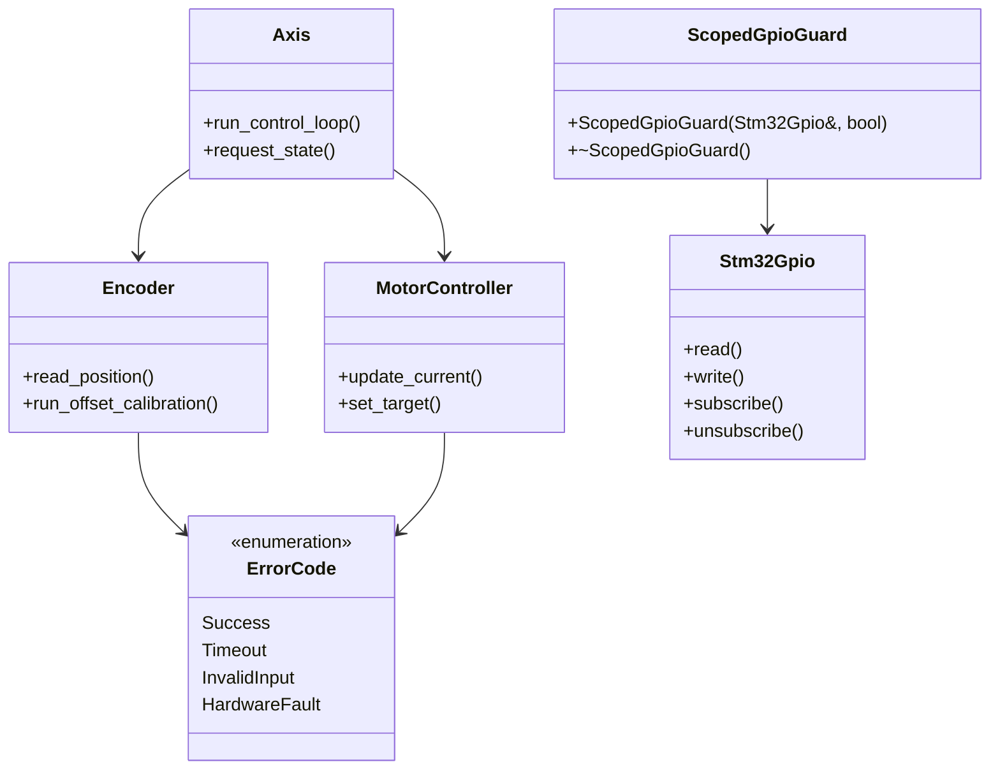
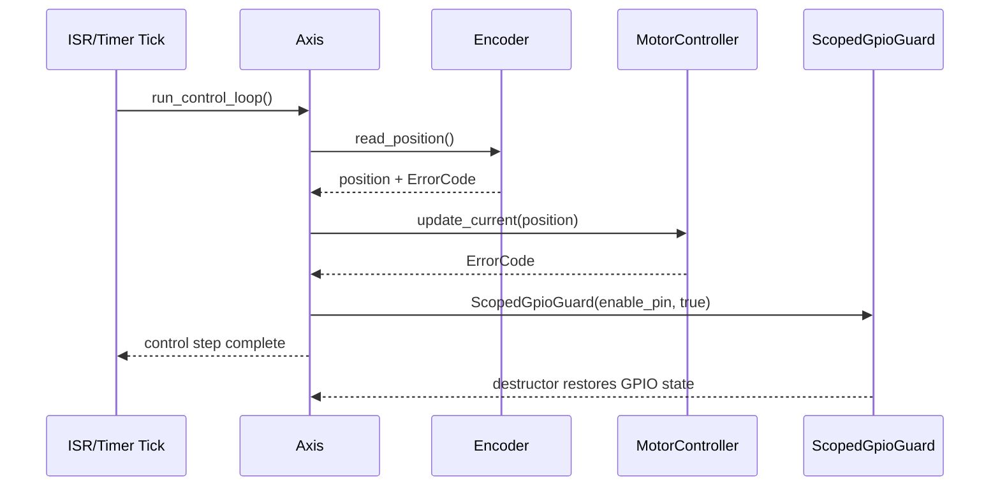

# C++ Architecture Documentation (ODrive Embedded Context)

## Purpose

This document provides a C++-focused architecture view for embedded ODrive-style firmware components, including class relationships, execution flow, and edge-case handling expectations.

## Scope

- Embedded C++ firmware modules (motor control, drivers, communication)
- Deterministic runtime behavior (no dynamic allocation in hot paths)
- Exception-free error handling using explicit status/error codes

## High-Level UML (Class Diagram)

## Behavioral UML (Control Sequence)

## Edge Cases and Expected Behavior

1. **Sensor unavailable at startup**
   - Expected: return explicit error code (`Timeout`/`HardwareFault`), avoid hard fault, keep actuator disabled.
2. **Calibration aborted midway**
   - Expected: preserve last known-safe state, report non-success `ErrorCode`, do not continue closed-loop control.
3. **Invalid command parameters**
   - Expected: reject with `InvalidInput`, clamp only when policy explicitly allows it.
4. **ISR/task race on shared state**
   - Expected: single-producer/single-consumer access pattern, volatile/atomic strategy documented per variable.
5. **Early return in critical section**
   - Expected: RAII guard (`ScopedGpioGuard`) restores pin/resource state on every path.
6. **Communication timeout (UART/CAN/USB)**
   - Expected: non-blocking timeout handling, bounded retry policy, deterministic fallback state.

## Missing features

The following features/standards are recommended but not fully specified in the current lesson materials:

1. **Formal UML-to-code traceability**
   - Missing direct mapping from UML elements to exact source symbols/files for each release.
2. **Documented coding-standard enforcement in CI**
   - Standards are referenced (e.g., C++ Core Guidelines, MISRA), but automated pass/fail checks are not explicitly documented in this lesson page.
3. **Explicit real-time timing budget table**
   - No cycle-time/jitter budget table is included for each control-loop phase.
4. **Memory policy verification checklist**
   - No explicit checklist proving static allocation/no-heap policy across all critical modules.
5. **Concurrency contract matrix**
   - Missing a per-variable ownership/ISR-access matrix (who writes, who reads, protection model).

## Validation checklist

- UML reflects actual subsystem responsibilities at a high level
- Error-first, exception-free embedded pattern is documented
- Edge-case behavior is deterministic and testable
- Missing standards/features are explicitly called out for follow-up
